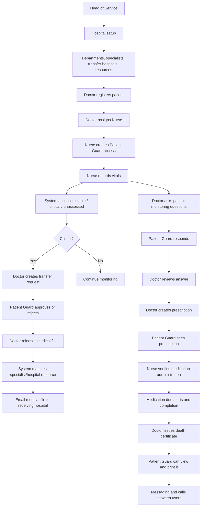

# Clinical workflow implementation plan

This document captures the exact care flow requested for the hospital system and maps it to the modules already present in the codebase.

## Goal

Build a coherent patient-care workflow in which:

1. the Head of Service configures the hospital and transfer resources,
2. the Doctor registers patients and assigns care staff,
3. the Nurse creates Patient Guard access and records vital signs,
4. the system analyzes vital signs and escalates critical cases,
5. the Doctor initiates transfer and monitoring workflows,
6. the Patient Guard can review and respond to the workflow,
7. clinical documents, prescriptions, and medication due checks remain connected across roles.

---

## Workflow overview

---

## Phase 1: Head of Service hospital setup

### Responsibilities

- configure hospital profile,
- configure departments,
- define specialties and clinical conditions,
- manage resources and room/bed inventory,
- define external hospitals and referral specialties,
- define vital-sign clinical rules.

### Existing code modules

- Frontend: `frontend/src/modules/head-of-service/...`
- Backend: `backend/apps/hospital/...`
- Rule definitions: `backend/apps/vital_signs/...`

### Key files

- `frontend/src/modules/head-of-service/dashboard/DashboardPage.tsx`
- `frontend/src/modules/head-of-service/hospital-information/`
- `frontend/src/modules/head-of-service/specialties/`
- `frontend/src/modules/head-of-service/resources/`
- `frontend/src/modules/head-of-service/external-hospitals/`
- `frontend/src/modules/head-of-service/clinical-rules/ClinicalRulesPage.tsx`
- `backend/apps/hospital/api/views/__init__.py`
- `backend/apps/hospital/api/views/core.py`

### Definition of done

- the Head of Service can configure hospital details,
- departments and specialties are stored,
- external hospitals and specialties are linked,
- resource status can be tracked,
- the clinical rule set is active and can be updated.

---

## Phase 2: Doctor patient registration and staff assignment

### Responsibilities

- register the patient,
- assign the Nurse to the patient,
- connect the patient to the active care episode,
- open the patient dashboard and care history.

### Existing code modules

- `frontend/src/modules/doctor/patients/RegisterPatientPage.tsx`
- `frontend/src/modules/doctor/patients/DoctorPatientDetailPage.tsx`
- `backend/apps/patients/services/`
- `backend/apps/patients/api/views/patients.py`

### Definition of done

- a doctor can create a new patient record,
- the patient is linked to an assigned nurse,
- the patient is visible to the correct role-based dashboards,
- patient details can be opened, edited, archived, and reviewed.

---

## Phase 3: Nurse Patient Guard invitation and access

### Responsibilities

- invite Patient Guard,
- confirm relationship to patient,
- grant access to the medical workflow,
- allow patient guard to view patient information and release-specific data.

### Existing code modules

- `frontend/src/modules/nurse/patient-guards/PatientGuardsPage.tsx`
- `frontend/src/modules/nurse/patients/NursePatientDetailPage.tsx`
- `backend/apps/patients/services/guardians.py`
- `backend/apps/patients/models/guardians.py`

### Definition of done

- the nurse can create and manage Patient Guard access,
- the guard receives the relationship and sees only the relevant patient data,
- the guard is tracked as an active care participant, not a general platform user.

---

## Phase 4: Vitals recording and clinical assessment

### Responsibilities

- record vital signs from the Nurse dashboard,
- evaluate the values against active hospital rules,
- assign status as `STABLE`, `CRITICAL`, or `UNASSESSED`,
- display percentage-based stability and criticality.

### Existing code modules

- `frontend/src/modules/nurse/vital-signs/RecordVitalSignsPage.tsx`
- `frontend/src/modules/vital-signs/shared/VitalHistory.tsx`
- `backend/apps/vital_signs/services/analysis.py`
- `backend/apps/vital_signs/services/metrics.py`
- `backend/apps/vital_signs/models/observations.py`

### Definition of done

- the nurse can record temperature, pulse, respiration, blood pressure, and other configured metrics,
- the system calculates assessed and critical metrics,
- the patient receives a stability and criticality score,
- the doctor sees a clear patient status summary.

---

## Phase 5: Doctor monitoring and patient-guard responses

### Responsibilities

- ask monitoring questions to the Patient Guard,
- receive answers back from the guard,
- review trending care updates.

### Existing code modules

- `frontend/src/modules/doctor/monitoring/DoctorMonitoringPage.tsx`
- `frontend/src/modules/patient-guard/monitoring/PatientGuardMonitoringPage.tsx`
- `backend/apps/monitoring/...`

### Definition of done

- the doctor can create monitoring threads for a patient,
- the Patient Guard answers questions with the correct response type,
- the response is visible to the doctor,
- the system records current and historical answers clearly.

---

## Phase 6: Transfer request and referral coordination

### Responsibilities

- doctor creates a patient transfer request when care exceeds local capacity or requires a specialist,
- patient guard reviews and approves or rejects,
- system selects a receiving hospital based on specialty/resource matching,
- medical file is sent to the receiving facility.

### Existing code modules

- `frontend/src/modules/doctor/transfers/DoctorTransfersPage.tsx`
- `frontend/src/modules/patient-guard/transfers/PatientGuardTransfersPage.tsx`
- `backend/apps/transfers/services/transfers.py`
- `backend/apps/hospital/...` for specialty/resource configuration

### Definition of done

- transfer requests are generated from the doctor workflow,
- patient guard approval is captured properly,
- receiving hospitals and specialties are matched,
- the medical file can be packaged and sent via the configured communication layer.

---

## Phase 7: Prescriptions and medication administration

### Responsibilities

- doctor creates a prescription,
- patient guard views the active prescription,
- nurse administers medication according to schedule,
- system alerts due doses and records outcomes.

### Existing code modules

- `frontend/src/modules/doctor/prescriptions/`
- `frontend/src/modules/patient-guard/prescriptions/`
- `frontend/src/modules/nurse/medication/MedicationPage.tsx`
- `backend/apps/prescriptions/...`

### Definition of done

- the doctor can create clinical prescriptions,
- the patient guard sees them in their dashboard,
- the nurse can complete or record medication administration,
- due-dose alerts are triggered on time.

---

## Phase 8: Death certificate workflow

### Responsibilities

- doctor issues a death certificate when required,
- patient guard can access and print the certificate,
- certificate visibility remains controlled and auditable.

### Existing code modules

- `frontend/src/modules/doctor/death-certificates/DoctorDeathCertificatesPage.tsx`
- `frontend/src/modules/patient-guard/death-certificates/PatientGuardDeathCertificatesPage.tsx`
- `backend/apps/death_certificates/...`

### Definition of done

- doctor can issue a valid certificate for the patient,
- the patient guard can view it without breaking permissions,
- the document is printable and stored in the record system.

---

## Phase 9: Messaging and calls

### Responsibilities

- message between user roles,
- seen/delivered acknowledgment is tracked,
- direct calls can be initiated and connected,
- call sessions are tied to the patient or conversation context.

### Existing code modules

- `frontend/src/modules/messages/MessagesPage.tsx`
- `frontend/src/modules/calls/CallsPage.tsx`
- `frontend/src/app/providers/RealtimeProvider.tsx`
- `backend/apps/messaging/...`
- `backend/apps/calls/...`

### Definition of done

- unread and delivered state is visible in the chat,
- messages reach the correct users,
- Twilio call initiation works when configured,
- call session history is available.

---

## Phase 10: Medical-file email dispatch

### Responsibilities

- package the patient file for transfer,
- include the correct clinical data and patient information,
- send the file via SMTP/email to the receiving hospital.

### Existing code modules

- `backend/apps/clinical_records/...`
- `backend/apps/transfers/...`
- `backend/integrations/email/...`

### Definition of done

- the system can identify the receiving facility,
- the medical file is assembled with the correct patient and clinician context,
- the email is sent using the configured SMTP service,
- sending is logged and auditable.

---

## Implementation priority for this sprint

### Sprint 1: first workflow slice

This is the most important slice to implement first:

1. Head of Service can configure hospital and specialty metadata.
2. Doctor registers a patient and assigns a Nurse.
3. Nurse invites/links a Patient Guard.
4. Nurse records vitals and the clinical score is visible.
5. The patient can be opened from the relevant role dashboards.

This slice creates the foundation for the rest of the product and matches the codebase architecture already in place.

---

## Notes

- The platform is already structured around role-scoped workflows; no major rewrite is needed.
- The work is mostly about verifying that the existing modules are wired together cleanly.
- The first implementation pass should prioritize correctness and role permissions before UI polish.
