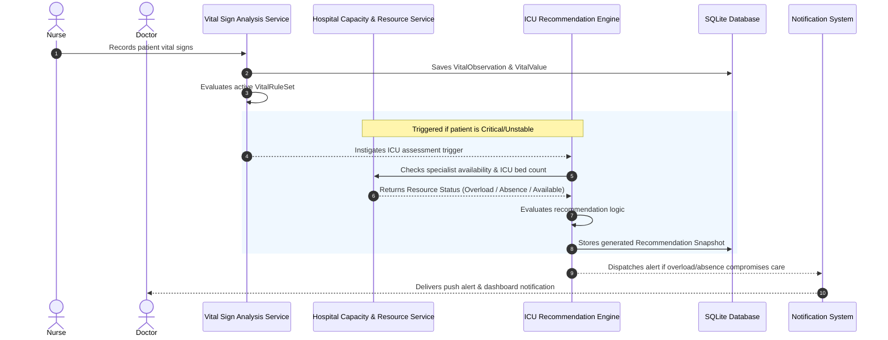

# ICU Recommendations System Architecture

This document outlines the implementation plan for the **Intensive Care Unit (ICU) Clinical Decision Support System (CDSS)**. The goal of this system is to identify patients requiring ICU care and generate explainable clinical recommendations—especially in cases of specialist overload or absence.

---

## 1. Core Principles (Velora Compliance)

To comply with Velora's system safety and clinical governance guidelines:
1. **No Opaque Algorithms**: All decision-support recommendations must be explainable, displaying the precise criteria met.
2. **No Seeded/Hardcoded Thresholds**: All clinical thresholds (vital signs or score limits) must be configurable by the **Head of Service** and approved before activation.
3. **No "AI" Labeling**: In accordance with the system design guidelines ([`SYSTEM_DESIGN.md`](./SYSTEM_DESIGN.md)), interfaces must not use the label **"AI"** directly to prevent over-reliance. Use terms like **"Clinical Decision Support"** or **"Recommended Actions"**.

---

## 2. Architecture & Data Flow



---

## 3. Implementation Blueprint

### A. Backend Implementation (Django)

#### 1. Models
* **Resource Capability / Shift Tracking**:
  * Track active specialist physician assignments in [`backend/apps/patients/models.py`](../backend/apps/patients/models.py) via the `PatientCareAssignment` model.
  * Monitor ICU Bed availability (`Bed` model) and specialist resources (`Resource` model) in [`backend/apps/hospital/models/resources.py`](../backend/apps/hospital/models/resources.py).
* **Clinical Recommendation Snapshot**:
  * Create a new model `IcuRecommendation` in a new application `backend/apps/clinical_recommendations/models.py` or extend `backend/apps/vital_signs/models/observations.py` to preserve a snapshot of the generated recommendation.

#### 2. Services
* **ICU Status Analyzer**:
  * Implement `backend/apps/clinical_recommendations/services/icu_analyzer.py`.
  * Logic:
    ```python
    def assess_icu_candidacy(patient, vital_observation):
        # 1. Check if patient is marked as Critical or has specific rules matched
        # 2. Query active ICU physician assignments (detect physician absence/overload)
        # 3. Query ICU room/bed status (detect bed capacity overload)
        # 4. Generate deterministic recommendation & audit event
    ```
* **Clinical Assessment Hook**:
  * Integrate the evaluation trigger inside `record_and_analyze_observation` in [`backend/apps/vital_signs/services/analysis.py`](../backend/apps/vital_signs/services/analysis.py).

---

### B. Frontend Implementation (React / Vite)

#### 1. Configuration & Clinical Governance (Head of Service)
* **Threshold Management**:
  * Extend [`ClinicalRulesPage.tsx`](../frontend/src/modules/head-of-service/clinical-rules/ClinicalRulesPage.tsx) to allow configuring metrics specifically targeted for **"ICU Escalation Assessment"**.
  * Add UI controls to manage rule parameters that trigger when ICU specialist resource capacity is limited.

#### 2. Clinical Workspace (Doctor)
* **Dashboard Warning System**:
  * In [`DoctorDashboardPage.tsx`](../frontend/src/modules/doctor/dashboard/DoctorDashboardPage.tsx), add a high-priority warning component indicating when an assigned patient meets ICU criteria but there is local **Specialist Absence** or **ICU Bed Overload**.
* **Patient Context Detail**:
  * In [`DoctorPatientDetailPage.tsx`](../frontend/src/modules/doctor/patients/DoctorPatientDetailPage.tsx), introduce an **Explainable Decision Support Card** to display generated transfer/escalation suggestions.
  * Add a button: *"Review Transfer Options"* which links directly to the deterministic Transfer Recommendation engine if local care is delayed.
